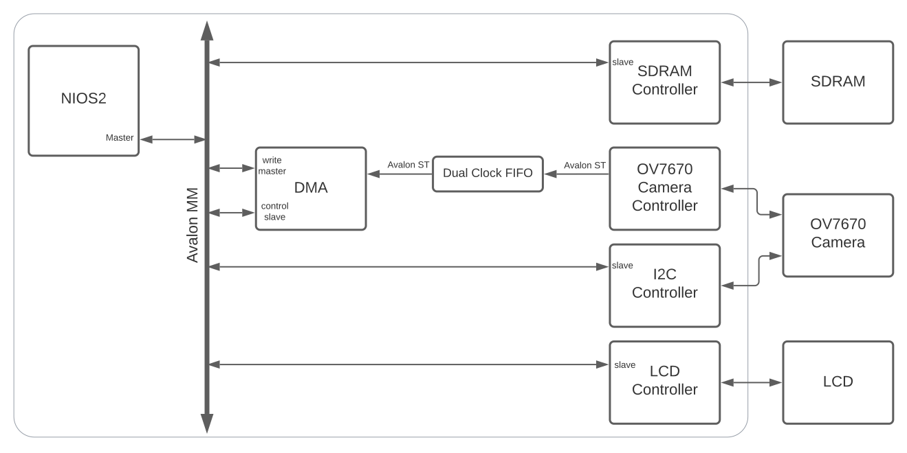

# Repository Outline

## ARM Cortex-m4 projects
### lcd
This project tests the ILI9896 LCD's SPI interface by drawing a red square. The SPI interface is located in
the mystm32lib directory
### mystm32lib
  This directory is an archive of API's for commonly used hardware components on my Nucleo board
### pan_tilt_servos
---

## AXI memory slave
  In this project, I designed a component that contained a block of SRAM. The AXI interface was used
  to control burst-capable read/write transfers.
  
  Skills used:
  - VHDL
  - Hardware design
  - Verification using a VHDL testbench with OSVVM library

## Matrix
  This project implementats a matrix class using C++. To test the class, I decided to use the
  Numpy (a Python library) because it gives me an excuse to practice Python scripting and socket programming.
  The Python script sets up a server and waits for the test program to send request. These request are the matrix operands
  and the type of operation. With this information, the server performs the desired
  operation on the desired matrices, and sends back the result.
  
  Skill used:
  - C++
  - Python
  - Object oriented programming
  - TCP/IP socket programming
  - linear algebra

## Max10 FPGA projects
###  lcd_camera
  In this project, I designed hardware to control an LCD and Camera. For software, I wrote drivers for both
  components, and integrated them into the HAL provided by Intel.
  
  Skills used:
  - VHDL
  - System-on-chip design
  - Hardware design
  - Verification using a VHDL testbench with OSVVM library
  - C programming
  - HAL driver development
  - DMA and interrupt-driven programing
  - I2C was used to send commands to the camera

